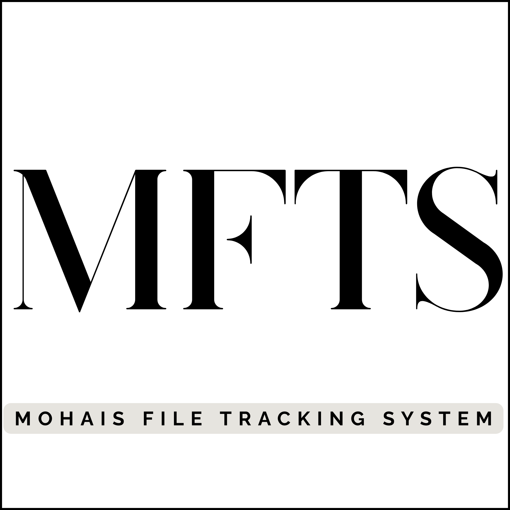

# File Tracking Management System (FTMS)

<p align="center">
  
</p>

<p align="center">
  <strong>A Comprehensive Web-Based File Tracking Solution for Ministry of Home Affairs and Internal Security</strong>
</p>

<p align="center">
  <a href="#"></a>
  <a href="#"></a>
  <a href="#"></a>
  <a href="#"></a>
  <a href="#"></a>
  <a href="#"></a>
</p>

---

## Table of Contents

- [Overview](#overview)
- [Features](#features)
- [System Architecture](#system-architecture)
- [Technology Stack](#technology-stack)
- [Installation](#installation)
- [Configuration](#configuration)
- [User Roles & Permissions](#user-roles--permissions)
- [File Management Workflow](#file-management-workflow)
- [Screenshots](#screenshots)
- [Testing](#testing)
- [Deployment](#deployment)
- [API Documentation](#api-documentation)
- [Contributing](#contributing)
- [License](#license)
- [Support](#support)

---

## Overview

The **File Tracking Management System (FTMS)** is a comprehensive web-based solution designed to digitize and streamline the management of physical files within the Ministry of Home Affairs. The system provides real-time tracking of file locations, maintains complete audit trails, and facilitates seamless file transfers between departments.

### Key Objectives

- **Real-Time File Tracking**: Instant visibility into file locations and status
- **Comprehensive Audit Trail**: Complete history of all file movements
- **Automated Documentation**: Replace manual logbooks with digital records
- **Role-Based Access Control**: Secure authentication with distinct user roles
- **Performance Analytics**: Dashboards and reporting capabilities

---

## Features

### Core Features

#### 1. File Registration & Management
- Auto-generation of unique file numbers (FTS-YYYYMMDD-XXXX format)
- Support for legacy file number references
- Priority classification (Normal, Urgent, Very Urgent)
- Confidentiality levels (Public, Confidential, Secret)
- Digital attachment support (up to 10MB)
- SLA tracking with default 3-day processing window

#### 2. File Transfer & Tracking
- Intuitive file sending interface
- Recipient search with department filtering
- Multiple delivery methods (Internal Messenger, Hand Carry, Courier, Email)
- Optional sender comments and hand-carry designations
- Complete movement history tracking

#### 3. Receipt Confirmation System
- Pending receipts dashboard
- One-click confirmation
- Automatic status updates
- Bulk confirmation capabilities

#### 4. Role-Based Access Control
Four distinct user roles:
- **Admin**: Full system access including employee management
- **Registry Head**: File management, user creation, file merging
- **Registry Staff**: File operations, transfers, tracking
- **Department User**: Department-level file operations

#### 5. Dashboard & Reporting
- Registry Dashboard: Statistics, pending receipts, recent activity
- Department Dashboard: My files, pending actions, department overview
- Admin Dashboard: System-wide metrics, audit logs
- CSV export functionality
- Real-time counters and visual indicators

#### 6. Organizational Structure Management
- Department and unit hierarchy configuration
- Position management with hierarchical levels
- Department and unit head assignments
- Employee-to-department/unit mapping

#### 7. File Merging
- Merge file copies back into original files
- Preservation of complete movement history
- Audit trail of merge operations

---

## System Architecture

### High-Level Architecture

```
┌─────────────────────────────────────────────────────────────────┐
│                        CLIENT LAYER                             │
│  ┌─────────────┐  ┌─────────────┐  ┌─────────────┐             │
│  │   Desktop   │  │   Tablet    │  │   Mobile    │             │
│  │   Browser   │  │   Browser   │  │   Browser   │             │
│  └─────────────┘  └─────────────┘  └─────────────┘             │
└─────────────────────────────────────────────────────────────────┘
                              │
                              ▼ HTTPS
┌─────────────────────────────────────────────────────────────────┐
│                 APPLICATION SERVER LAYER                        │
│                      Laravel 12.0 + Livewire                    │
│  ┌──────────┐  ┌──────────┐  ┌──────────┐  ┌──────────┐        │
│  │  Router  │  │Middleware│  │Controller│  │ Livewire │        │
│  └──────────┘  └──────────┘  └──────────┘  └──────────┘        │
└─────────────────────────────────────────────────────────────────┘
                              │
                              ▼
┌─────────────────────────────────────────────────────────────────┐
│                     DATA STORAGE LAYER                          │
│  ┌─────────────────────────┐  ┌─────────────────────────┐      │
│  │      MySQL 8.0          │  │    File Storage         │      │
│  │  - Employees            │  │  - Attachments          │      │
│  │  - Files                │  │  - Exports              │      │
│  │  - File Movements       │  │                         │      │
│  │  - Audit Logs           │  │                         │      │
│  └─────────────────────────┘  └─────────────────────────┘      │
└─────────────────────────────────────────────────────────────────┘
```

---

## Technology Stack

| Component | Technology | Version |
|-----------|-----------|---------|
| **Backend Framework** | Laravel | 12.0 |
| **Frontend Components** | Livewire | 3.0+ |
| **Language** | PHP | 8.2+ |
| **CSS Framework** | Tailwind CSS | 3.x |
| **Database** | MySQL / SQLite | 8.0 / 3.x |
| **Authentication** | Laravel Breeze | 2.3 |
| **PDF Generation** | DOMPDF | 3.1 |
| **Build Tool** | Vite | Latest |
| **Testing** | PHPUnit | 11.0+ |

---

## Installation

### Prerequisites

- PHP 8.2 or higher
- Composer
- Node.js 18+ and NPM
- MySQL 8.0 or SQLite (for development)
- Git

### Step 1: Clone Repository

```bash
git clone https://github.com/123Benaiah/file-tracking-system.git
cd file-tracking-system
```

### Step 2: Install Dependencies

```bash
# Install PHP dependencies
composer install

# Install JavaScript dependencies
npm install
```

### Step 3: Environment Configuration

```bash
# Copy environment file
cp .env.example .env

# Generate application key
php artisan key:generate
```

Edit `.env` file with your database credentials:

```env
APP_NAME="File Tracking System"
APP_ENV=local
APP_URL=http://localhost

DB_CONNECTION=mysql
DB_HOST=127.0.0.1
DB_PORT=3306
DB_DATABASE=ftms
DB_USERNAME=your_username
DB_PASSWORD=your_password
```

### Step 4: Database Setup

```bash
# Run migrations
php artisan migrate

# Seed database with initial data
php artisan db:seed
```

### Step 5: Storage Setup

```bash
# Create storage link
php artisan storage:link
```

### Step 6: Build Assets

```bash
# Development build
npm run dev

# Production build
npm run build
```

### Step 7: Start Development Server

```bash
php artisan serve
```

Access the application at: `http://localhost:8000`

### Default Credentials

- **Registry Head**: REGHEAD001 / Moha@2024
- **Sample Users**: EMP001-EMP005 / Password123

---

## Configuration

### Environment Variables

| Variable | Description | Default |
|----------|-------------|---------|
| `APP_NAME` | Application name | File Tracking System |
| `APP_ENV` | Environment (local/production) | local |
| `APP_URL` | Application URL | http://localhost |
| `DB_CONNECTION` | Database driver | mysql |
| `DB_DATABASE` | Database name | ftms |
| `MAIL_MAILER` | Mail driver | log |

### File Upload Configuration

Maximum file upload size is set to 10MB. Configure in `php.ini`:

```ini
upload_max_filesize = 20M
post_max_size = 20M
```

---

## User Roles & Permissions

### Role Overview

| Feature | Admin | Registry Head | Registry Staff | Dept User |
|---------|-------|---------------|----------------|-----------|
| **Dashboard** |
| Admin Dashboard | ✓ | ✗ | ✗ | ✗ |
| Registry Dashboard | ✗ | ✓ | ✓ | ✗ |
| Department Dashboard | ✗ | ✗ | ✗ | ✓ |
| **File Management** |
| Create Files | ✗ | ✓ | ✗ | ✗ |
| Edit Any File | ✗ | ✓ | ✗ | ✗ |
| Send Files | ✗ | ✓ | ✓ | ✓ |
| Receive/Confirm Files | ✗ | ✓ | ✓ | ✓ |
| Track Files | ✓ | ✓ | ✓ | ✓ |
| Merge Files | ✗ | ✓ | ✗ | ✗ |
| **User Management** |
| Manage Employees | ✓ | ✗ | ✗ | ✗ |
| Create Department Users | ✗ | ✓ | ✗ | ✗ |
| **Organization** |
| Manage Departments | ✓ | ✗ | ✗ | ✗ |
| Manage Units | ✓ | ✗ | ✗ | ✗ |
| Manage Positions | ✓ | ✗ | ✗ | ✗ |
| **System** |
| View Audit Logs | ✓ | ✗ | ✗ | ✗ |
| Export Data | ✓ | ✓ | ✓ | ✓ |

---

## File Management Workflow

### File Lifecycle

1. **Registration** (Registry Staff)
   - File registered at registry
   - Auto-generated file number assigned
   - Initial status: `at_registry`

2. **Sending** (Any User)
   - User selects recipient
   - FileMovement record created
   - Status changes to `in_transit`

3. **Receiving** (Recipient)
   - Recipient confirms receipt
   - Movement updated with actual_receiver
   - Status changes to `received`

4. **Processing** (Recipient)
   - User reviews file
   - Status can change to `under_review` or `action_required`

5. **Returning to Registry** (Department User)
   - Send back to registry staff
   - Status changes to `completed` or `returned_to_registry`

6. **Merging** (Registry Head)
   - Copies merged into original
   - Copy files soft-deleted
   - Movement history preserved

### File Statuses

- `at_registry` - Currently at registry
- `in_transit` - Being transferred
- `received` - Received by user
- `under_review` - Being processed
- `action_required` - Needs attention
- `completed` - Processing complete
- `returned_to_registry` - Back at registry
- `archived` - Archived
- `merged` - Merged into another file

---

## Screenshots

*Screenshots will be added here showing:*
- Login Page
- Registry Dashboard
- File Registration Form
- Send File Interface
- Track File Page
- Admin Panel

---

## Testing

### Running Tests

```bash
# Run all tests
php artisan test

# Run specific test suite
php artisan test --filter=Auth

# Run with coverage
php artisan test --coverage
```

### Test Structure

```
tests/
├── Feature/
│   ├── Auth/
│   │   ├── AuthenticationTest.php
│   │   ├── EmailVerificationTest.php
│   │   ├── PasswordConfirmationTest.php
│   │   ├── PasswordResetTest.php
│   │   ├── PasswordUpdateTest.php
│   │   └── RegistrationTest.php
│   ├── ExampleTest.php
│   └── ProfileTest.php
└── Unit/
    └── ExampleTest.php
```

### Manual Testing Checklist

- [ ] User authentication (login/logout)
- [ ] File registration
- [ ] File sending and receiving
- [ ] Role-based access control
- [ ] Dashboard functionality
- [ ] CSV export
- [ ] File merging
- [ ] Audit logging

---

## Deployment

### Production Server Requirements

**Minimum:**
- CPU: 2 vCPU cores
- RAM: 4 GB
- Storage: 50 GB SSD
- PHP 8.2+
- MySQL 8.0

**Recommended:**
- CPU: 4 vCPU cores
- RAM: 8 GB
- Storage: 100 GB SSD

### Deployment Steps

```bash
# Clone repository
git clone https://github.com/123Benaiah/file-tracking-system.git /var/www/ftms
cd /var/www/ftms

# Install dependencies (production)
composer install --no-dev --optimize-autoloader
npm ci
npm run build

# Set environment
cp .env.example .env
php artisan key:generate

# Configure .env for production
# ...

# Run migrations
php artisan migrate --force

# Optimize
php artisan config:cache
php artisan route:cache
php artisan view:cache

# Set permissions
sudo chown -R www-data:www-data storage bootstrap/cache
sudo chmod -R 775 storage bootstrap/cache

# Create storage link
php artisan storage:link
```

### Web Server Configuration

**Nginx:**

```nginx
server {
    listen 80;
    server_name ftms.yourdomain.com;
    root /var/www/ftms/public;
    
    index index.php index.html;
    
    location / {
        try_files $uri $uri/ /index.php?$query_string;
    }
    
    location ~ \.php$ {
        fastcgi_pass unix:/var/run/php/php8.2-fpm.sock;
        fastcgi_param SCRIPT_FILENAME $realpath_root$fastcgi_script_name;
        include fastcgi_params;
    }
    
    location ~ /\.(?!well-known).* {
        deny all;
    }
}
```

---

## API Documentation

### Authentication

| Method | Endpoint | Description |
|--------|----------|-------------|
| POST | /login | Authenticate user |
| POST | /logout | End session |
| POST | /forgot-password | Request password reset |
| POST | /reset-password | Reset password |

### File Management

| Method | Endpoint | Description |
|--------|----------|-------------|
| GET | /files | List files |
| POST | /files | Create file |
| GET | /files/{id} | Get file details |
| PUT | /files/{id} | Update file |
| DELETE | /files/{id} | Delete file |
| POST | /files/{id}/send | Send file |
| POST | /files/{id}/receive | Confirm receipt |

### User Management

| Method | Endpoint | Description |
|--------|----------|-------------|
| GET | /employees | List employees |
| POST | /employees | Create employee |
| GET | /employees/{id} | Get employee |
| PUT | /employees/{id} | Update employee |
| DELETE | /employees/{id} | Deactivate |

---

## Database Schema

### Key Tables

**employees**
- Primary key: employee_number (string)
- Fields: name, email, password, is_admin, is_registry_head
- Foreign keys: department_id, unit_id, position_id

**files**
- Primary key: id
- Unique: file_number (FTS-YYYYMMDD-XXXX)
- Fields: file_name, subject, priority, confidentiality, status
- Foreign keys: current_holder_employee_number, registered_by_employee_number

**file_movements**
- Primary key: id
- Foreign keys: file_id, sender_employee_number, intended_receiver_employee_number
- Fields: movement_status, sent_at, received_at, delivery_method

For complete schema, see [Database Documentation](docs/database.md).

---

## Contributing

We welcome contributions! Please follow these steps:

1. Fork the repository
2. Create a feature branch (`git checkout -b feature/amazing-feature`)
3. Commit your changes (`git commit -m 'Add amazing feature'`)
4. Push to the branch (`git push origin feature/amazing-feature`)
5. Open a Pull Request

### Code Standards

- Follow PSR-12 coding standards
- Write tests for new features
- Update documentation
- Ensure all tests pass

---

## License

This project is open-sourced software licensed under the [MIT license](LICENSE).

---

## Support

For support, please contact:

- **Email**: support@ftms.moha.gov
- **Issues**: [GitHub Issues](https://github.com/123Benaiah/file-tracking-system/issues)
- **Documentation**: [Wiki](https://github.com/123Benaiah/file-tracking-system/wiki)

---

## Acknowledgments

- Ministry of Home Affairs for the project opportunity
- Laravel Framework team for the excellent foundation
- All contributors and testers

---

<p align="center">
  <strong>Built with ❤️ for the Ministry of Home Affairs and Internal Security</strong>
</p>
